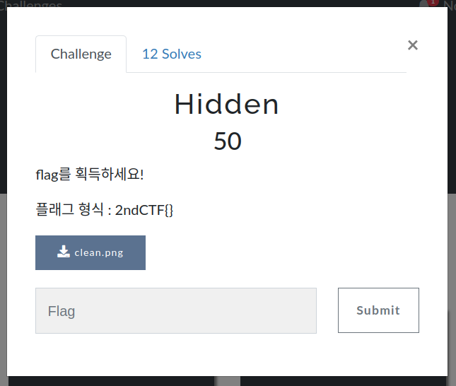
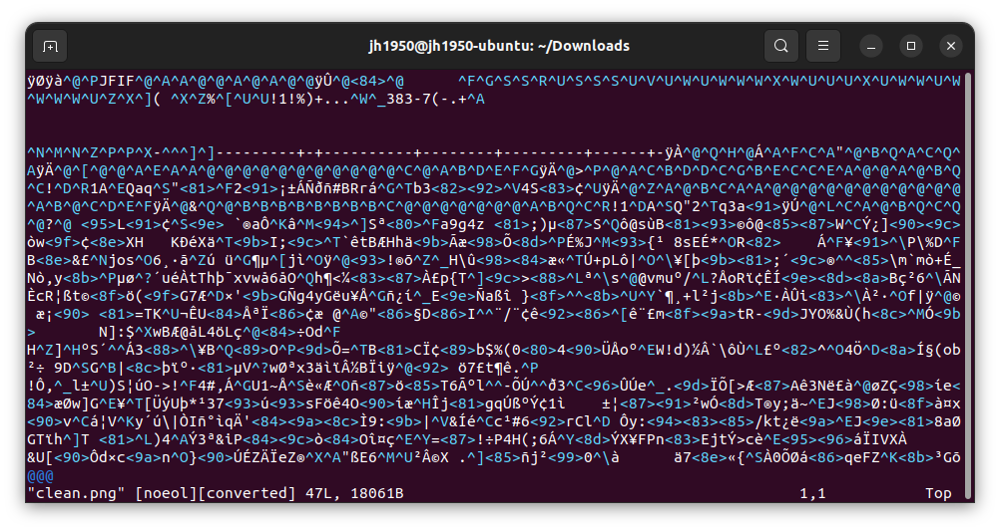
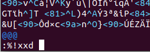
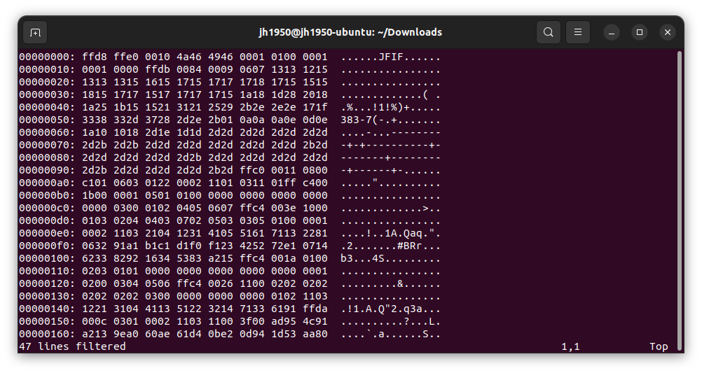
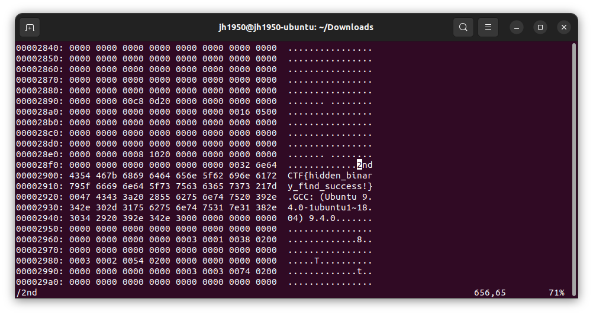

## Forensic - Hidden

### 문제
  
PNG 파일에 숨겨진 플래그를 찾아야 한다.

### 풀이
  
`clean.png` 파일의 정체는 귀여운 너구리 한 마리..!

이 파일을 vi 편집기로 열어보면?  
  
당연히 깨진다.

  
vi 편집기에서 `:%!xxd`를 입력해보자.

  
`clean.png`의 Hex code가 나온다.

여기서 플래그 형식의 일부인 `2nd`나 `CTF` 문자열을 검색하면  
  
플래그를 찾을 수 있다.
