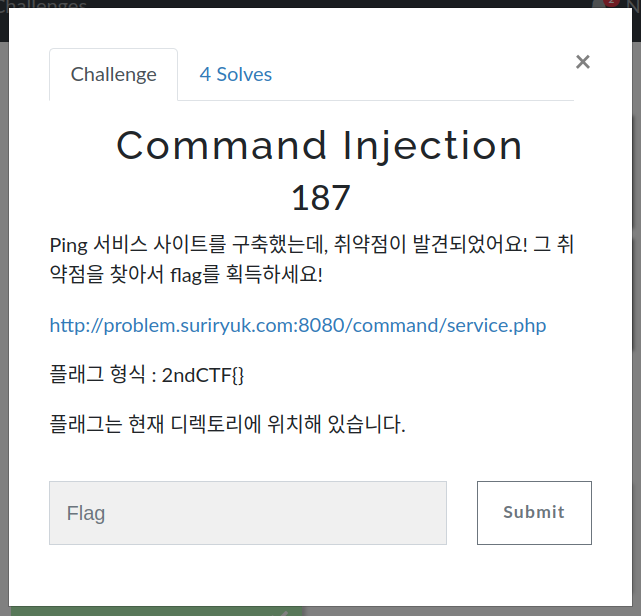
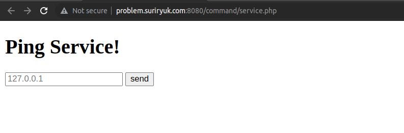
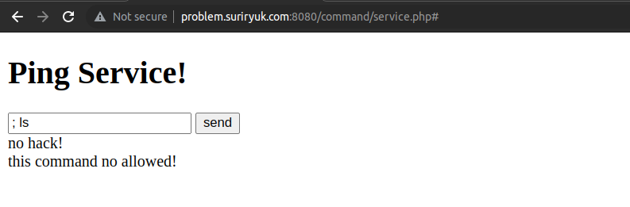
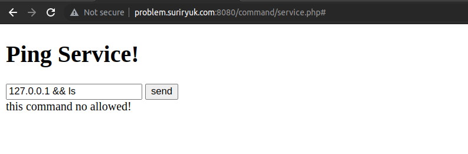
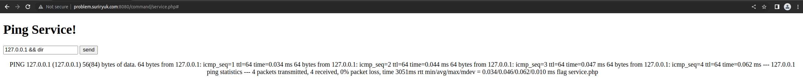
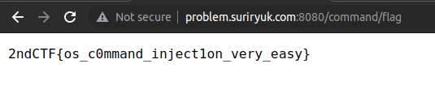

## Web - Command Injection

### 문제
  
이번엔 시스템 명령어를 이용해 플래그를 얻어내는 문제다.  
플래그는 현재 디럭토리에 있다고 한다.

### 풀이
  
Ping 서비스를 제공하는 페이지다.

제일 먼저 `ping` 명령어를 닫고 다른 명령어를 실행시켰더니  
  
안된다.

그 다음 `ping` 명령어를 정상적으로 실행 후 다른 명령어를 실행하면  
  
안된다. 하지만 `no hack`은 없어졌다.

그렇다면 `ls`가 아닌 윈도우 cmd에서 쓰이는 명령어인 `dir`을 입력해보자.  
  
됐다. 현재 디렉토리에 `flag`와 `service.php` 파일이 있다는 것을 알아냈다.

이제 URL에서 `service.php`를 지우고 `flag`를 입력하면  
  
플래그를 얻을 수 있다.

참고로 `127.0.0.1 && cat flag`는 안 먹히더라.
