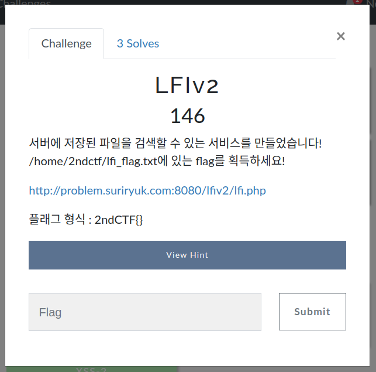
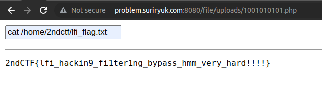
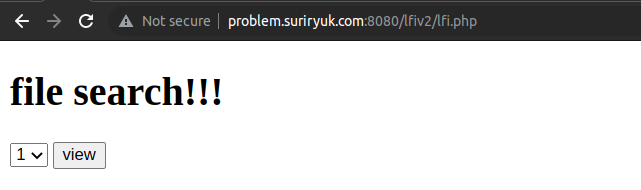
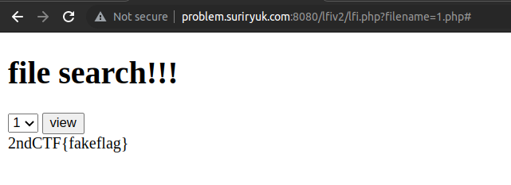
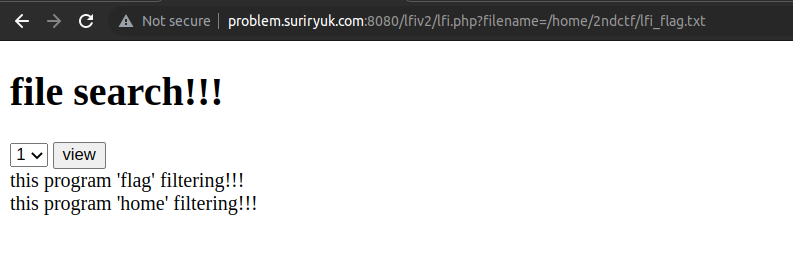
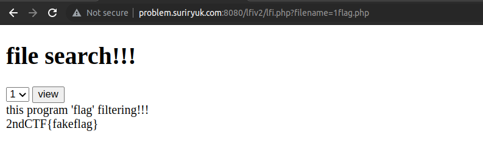
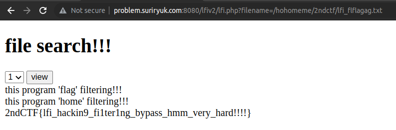

## Web - LFIv2

### 문제
  
이번에도 친절하게 플래그가 적힌 파일의 위치까지 알려준다.

### 풀이
이 문제는 1분만에 풀었다.  
  
`Web - file upload`에서 올린 웹셸을 이용해서..

### 진짜 풀이
  
기본 화면이다.

콤보박스에서 목록 선택 후 view를  누르면 특정 파일의 내용을 불러온다.  
  
여기서 중요한 건 폼이 `GET` 방식으로 전달되어 URL에 보여진다.  
즉, URL에서 `filename=` 뒤에 적힌 경로의 파일을 불러온다는 뜻이다.

그럼 `filename=/home/2ndctf/lfi_flag.txt`로 수정하면?  
  
`flag`와 `home`이 필터링에 걸렸다고 한다.

테스트를 위해 1flag.php로 수정해보자.  
  
flag 문자열이 필터링에 걸렸지만, 1.php의 파일 내용이 불러와진다.

그렇다는 것은 필터링에 걸린 문자열은 공백으로 치환한다는 뜻이니  
  
`/hohomeme/2ndctf/lfi_flflagag.txt`로 수정하면 플래그를 얻을 수 있다.
